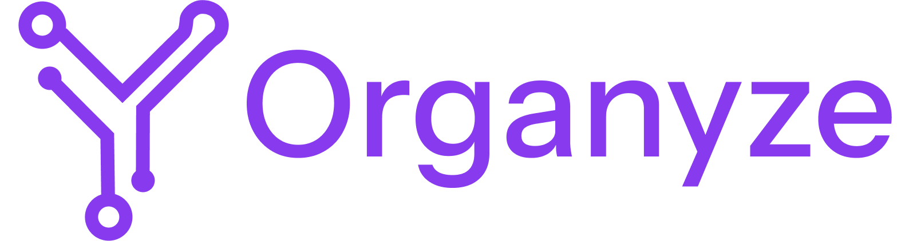
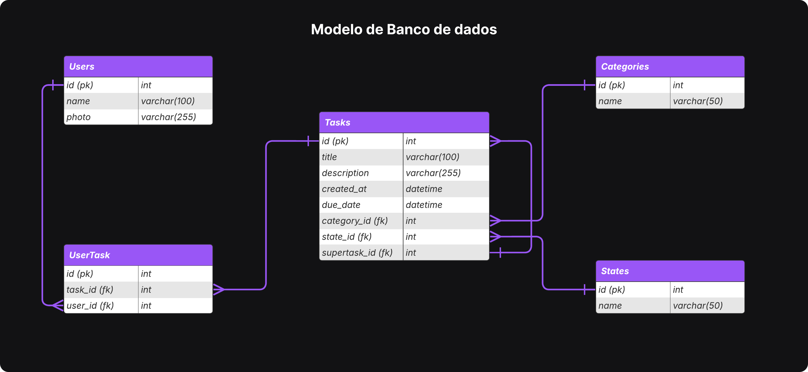
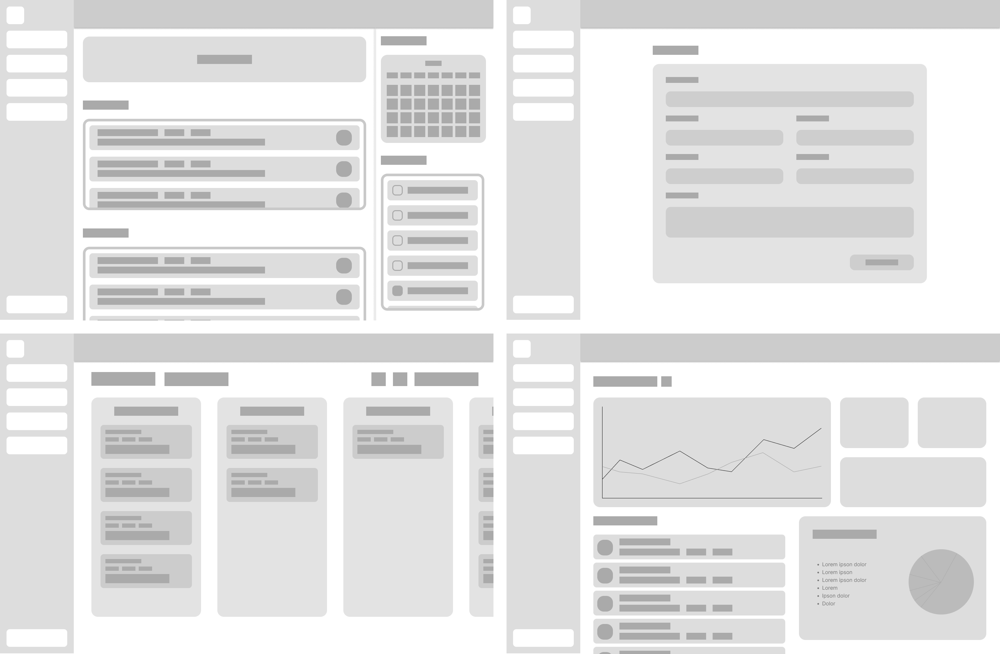

# Web Application Document - Projeto Individual - Módulo 2 - Inteli

---

#### Autor: Marcus Felipe dos Santos Valente

## Sumário

1. [Introdução](#c1)  
2. [Visão Geral da Aplicação Web](#c2)  
3. [Projeto Técnico da Aplicação Web](#c3)  
4. [Desenvolvimento da Aplicação Web](#c4)  
5. [Referências](#c5)  

## 1. Introdução

Na era digital atual, onde a gestão eficiente do tempo se tornou um desafio crucial, surge a necessidade de ferramentas que auxiliem na organização pessoal e profissional. Este projeto visa desenvolver um **gerenciador de tarefas para organização e produtividade** que atenda às demandas contemporâneas de produtividade e organização.

O sistema proposto busca simplificar a rotina dos usuários através de uma plataforma web intuitiva e acessível, permitindo um melhor controle sobre suas atividades diárias. Utilizando tecnologias modernas e práticas de desenvolvimento ágil, a aplicação foi concebida para se adaptar às diferentes necessidades de organização pessoal.

Com foco na experiência do usuário, o projeto incorpora elementos de design responsivo e interface amigável, garantindo que a ferramenta seja não apenas funcional, mas também agradável de usar. A solução proposta representa uma resposta às crescentes demandas por ferramentas digitais que promovam maior eficiência e bem-estar no gerenciamento do tempo.

---

## 2. Visão Geral da Aplicação Web

### 2.1. Personas

  

### 2.2. User Stories

### User Stories

1. **US01**: Como usuário, quero visualizar um dashboard com resumo das minhas principais tarefas, para que eu possa ter uma visão geral rápida das minhas atividades pendentes.

2. **US02**: Como usuário, quero adicionar novas tarefas com detalhes como título, descrição, prazo e categoria, para que eu possa registrar e gerenciar minhas atividades adequadamente.

3. **US03**: Como usuário, quero visualizar minhas tarefas em um quadro Kanban, para que eu possa acompanhar o progresso das atividades por estado (pendente, em andamento, concluído).

4. **US04**: Como usuário, quero acessar estatísticas e métricas sobre minha produtividade, para que eu possa analisar meu desempenho e identificar pontos de melhoria.

#### Análise INVEST da US01:

- **Independent**: A visualização do dashboard não depende de outras funcionalidades
- **Negotiable**: Os elementos e métricas exibidos podem ser ajustados
- **Valuable**: Oferece visão consolidada das atividades, agregando valor direto
- **Estimable**: Desenvolvimento possui complexidade técnica definida
- **Small**: Escopo específico para exibição de informações
- **Testable**: Pode ser validada através de testes de interface e integração

---

## 3. Projeto da Aplicação Web

### 3.1. Modelagem do banco de dados  (Semana 3)

### Modelo lógico

O modelo relacional representa a estrutura lógica do banco de dados, ilustrando as entidades principais do sistema e seus relacionamentos. No diagrama abaixo, são apresentadas as tabelas essenciais para o gerenciador de tarefas bem como seus atributos e as relações entre elas. O modelo abaixo foi projetado para um sistema de gerenciamento de tarefas colaborativas. Ele contempla usuários, tarefas, categorias, estados e o relacionamento entre esses elementos.

  

#### Tabela `Users`
Armazena informações dos usuários da plataforma.

- `id` (PK): Identificador único do usuário (chave primária).
- `name`: Nome do usuário (até 100 caracteres).
- `photo`: URL da foto de perfil do usuário (até 255 caracteres).

#### Tabela `Tasks`
Registra as tarefas criadas no sistema.

- `id` (PK): Identificador único da tarefa (chave primária).
- `title`: Título da tarefa (até 100 caracteres).
- `description`: Descrição detalhada da tarefa (até 255 caracteres).
- `created_at`: Data e hora de criação da tarefa.
- `due_date`: Prazo de entrega da tarefa.
- `category_id` (FK): Referência à categoria da tarefa.
- `state_id` (FK): Referência ao estado atual da tarefa (ex: pendente, concluída).
- `supertask_id` (FK): Referência à tarefa pai, caso essa tarefa seja uma subtarefa.

#### Tabela `Categories`
Define categorias que podem ser atribuídas às tarefas.

- `id` (PK): Identificador único da categoria.
- `name`: Nome da categoria (até 50 caracteres).

#### Tabela `States`
Define os estados possíveis para uma tarefa.

- `id` (PK): Identificador único do estado.
- `name`: Nome do estado (ex: "Pendente", "Em Progresso", "Concluído").

#### Tabela `UserTask`
Responsável por mapear a relação N:N entre usuários e tarefas.

- `id` (PK): Identificador único do vínculo.
- `task_id` (FK): Referência à tarefa atribuída.
- `user_id` (FK): Referência ao usuário responsável.

### Relacionamentos e Cardinalidade

O modelo de dados possui os seguintes relacionamentos entre as tabelas, com suas respectivas cardinalidades e funções no sistema:

#### 1. `Users` ↔ `Tasks` (N:N)
- **Descrição:** Um usuário pode estar associado a várias tarefas (por exemplo, tarefas que ele criou ou das quais participa), e uma tarefa pode estar associada a vários usuários (em casos de colaboração).
- **Implementação:** Essa relação é resolvida através da tabela intermediária `UserTask`, que contém as chaves estrangeiras `user_id` e `task_id`.
- **Cardinalidade:**
  - Um `User` pode estar vinculado a **nenhuma ou várias** `Tasks`.
  - Uma `Task` pode estar vinculada a **nenhum ou vários** `Users`.

#### 2. `Tasks` → `Categories` (N:1)
- **Descrição:** Cada tarefa pertence a uma única categoria, mas uma categoria pode agrupar várias tarefas.
- **Cardinalidade:**
  - Uma `Task` pertence a **exatamente uma** `Category`.
  - Uma `Category` pode conter **zero ou mais** `Tasks`.

#### 3. `Tasks` → `States` (N:1)
- **Descrição:** Cada tarefa tem um único estado atual (ex: "Pendente", "Concluído"). Um mesmo estado pode ser compartilhado por várias tarefas.
- **Cardinalidade:**
  - Uma `Task` pertence a **exatamente um** `State`.
  - Um `State` pode estar associado a **várias** `Tasks`.

#### 4. `Tasks` → `Tasks` (auto-relacionamento 1:N)
- **Descrição:** Uma tarefa pode ser uma subtarefa de outra. Esse relacionamento permite criar estruturas hierárquicas de tarefas.
- **Implementação:** Realizado através do campo `supertask_id`, que referencia a própria tabela `Tasks`.
- **Cardinalidade:**
  - Uma `Task` pode ser a subtarefa de **uma única** `Task` (ou de nenhuma, se for uma tarefa principal).
  - Uma `Task` pode ter **zero ou várias** subtarefas.

### Resumo visual das cardinalidades:

| Tabela A   | Relação | Tabela B   | Tipo de Relacionamento |
|------------|---------|------------|-------------------------|
| Users      | N:N     | Tasks      | Via `UserTask`          |
| Tasks      | N:1     | Categories | Muitas tarefas por categoria |
| Tasks      | N:1     | States     | Muitas tarefas por estado     |
| Tasks      | 1:N     | Tasks      | Uma tarefa com várias subtarefas |

### Modelo físico

O modelo físico do banco de dados foi implementado utilizando PostgreSQL, definindo as estruturas das tabelas, relacionamentos e constraints necessárias para suportar o gerenciador de tarefas. O schema inclui tabelas para usuários, listas de tarefas e as próprias tarefas, com seus respectivos atributos e chaves.

O arquivo SQL completo com o schema pode ser encontrado em: [others/modelo-fisico.sql](./others/modelo-fisico.sql)

### 3.1.1 BD e Models (Semana 5)
*Descreva aqui os Models implementados no sistema web*

### 3.2. Arquitetura (Semana 5)

*Posicione aqui o diagrama de arquitetura da sua solução de aplicação web. Atualize sempre que necessário.*

**Instruções para criação do diagrama de arquitetura**  
- **Model**: A camada que lida com a lógica de negócios e interage com o banco de dados.
- **View**: A camada responsável pela interface de usuário.
- **Controller**: A camada que recebe as requisições, processa as ações e atualiza o modelo e a visualização.
  
*Adicione as setas e explicações sobre como os dados fluem entre o Model, Controller e View.*

### 3.3. Wireframes (Semana 03)

O wireframe apresentado ilustra quatro telas principais do sistema, demonstrando o fluxo básico da aplicação:

  

As telas apresentadas são as seguintes:

- Tela inicial com um grande resumo das principais tarefas a serem concluídas pelo usuário
- Tela de adicionar tarefa
- Tela de vizualização em kamban
- Tela de estatísticas para vizualização do progresso na produtividade do usuário

### 3.4. Guia de estilos (Semana 05)

*Descreva aqui orientações gerais para o leitor sobre como utilizar os componentes do guia de estilos de sua solução.*

### 3.5. Protótipo de alta fidelidade (Semana 05)

*Posicione aqui algumas imagens demonstrativas de seu protótipo de alta fidelidade e o link para acesso ao protótipo completo (mantenha o link sempre público para visualização).*

### 3.6. WebAPI e endpoints (Semana 05)

*Utilize um link para outra página de documentação contendo a descrição completa de cada endpoint. Ou descreva aqui cada endpoint criado para seu sistema.*  

### 3.7 Interface e Navegação (Semana 07)

*Descreva e ilustre aqui o desenvolvimento do frontend do sistema web, explicando brevemente o que foi entregue em termos de código e sistema. Utilize prints de tela para ilustrar.*

---

## 4. Desenvolvimento da Aplicação Web (Semana 8)

### 4.1 Demonstração do Sistema Web (Semana 8)

*VIDEO: Insira o link do vídeo demonstrativo nesta seção*
*Descreva e ilustre aqui o desenvolvimento do sistema web completo, explicando brevemente o que foi entregue em termos de código e sistema. Utilize prints de tela para ilustrar.*

### 4.2 Conclusões e Trabalhos Futuros (Semana 8)

*Indique pontos fortes e pontos a melhorar de maneira geral.*
*Relacione também quaisquer outras ideias que você tenha para melhorias futuras.*

## 5. Referências

_Incluir as principais referências de seu projeto, para que seu parceiro possa consultar caso ele se interessar em aprofundar. Um exemplo de referência de livro e de site:_ 

---
---
