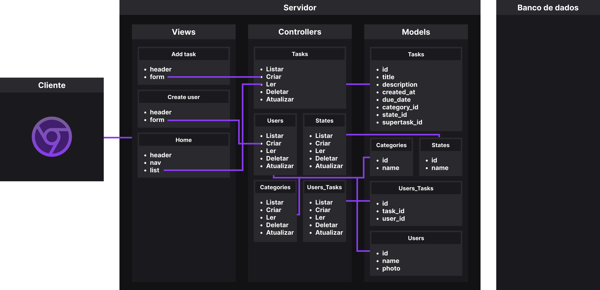
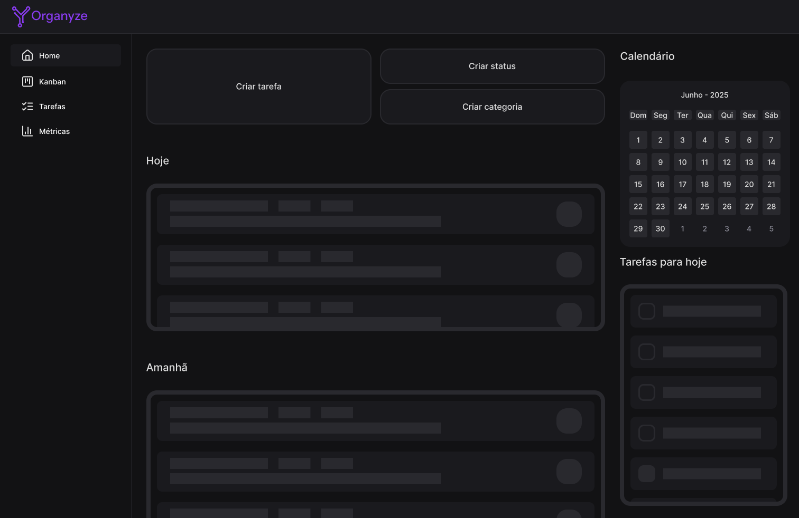
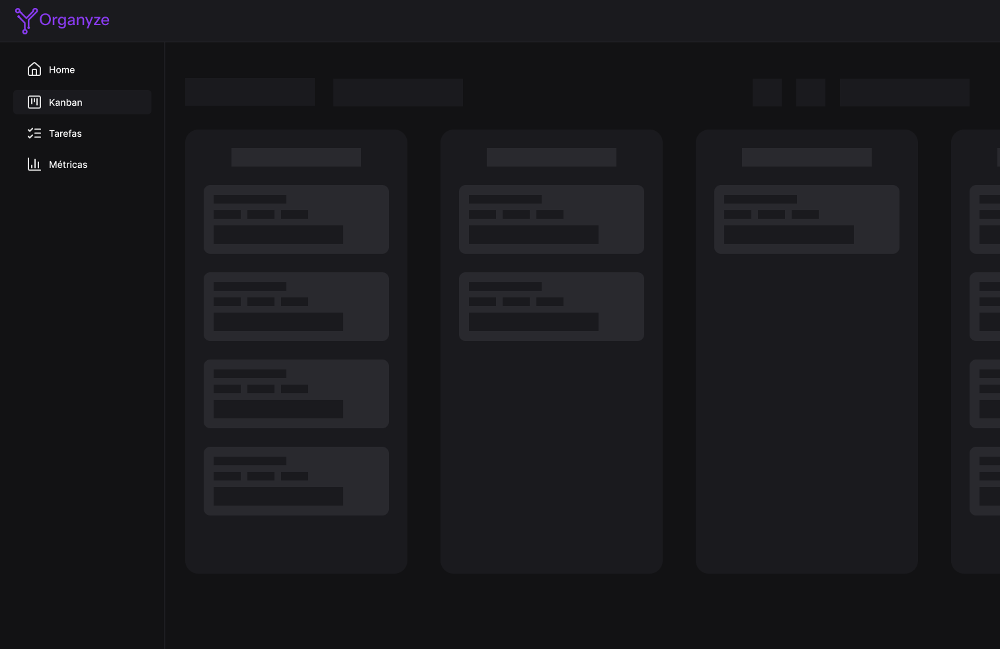
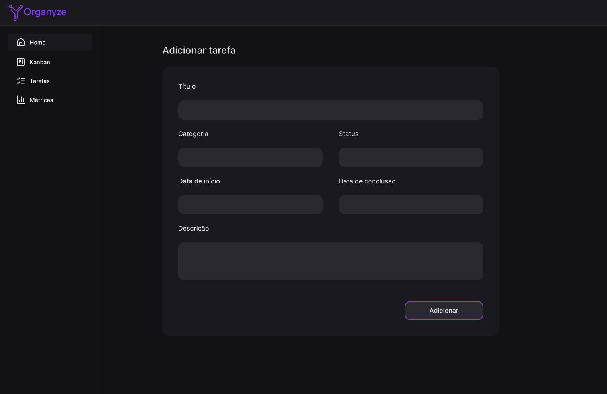
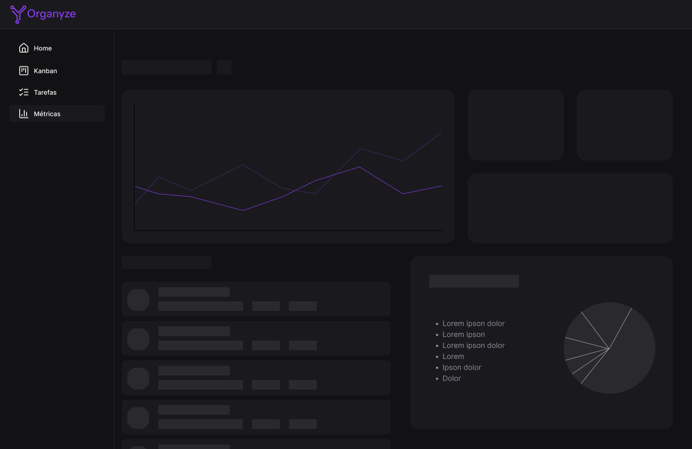
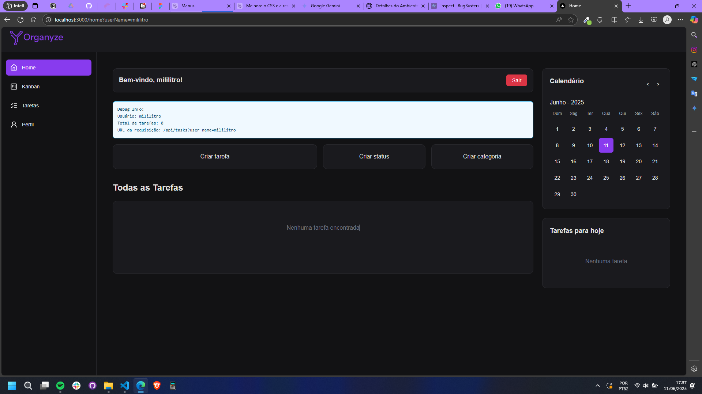
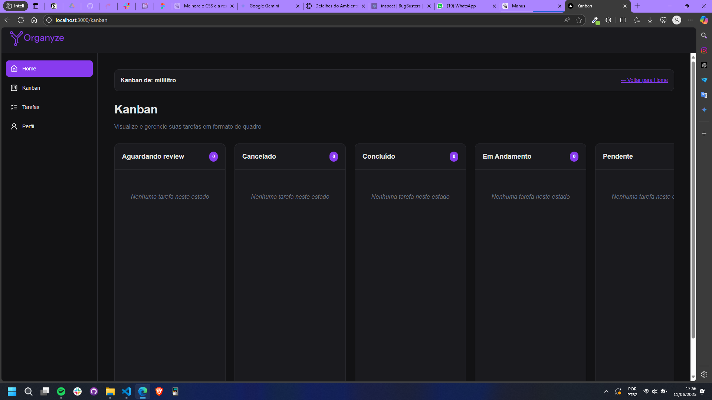
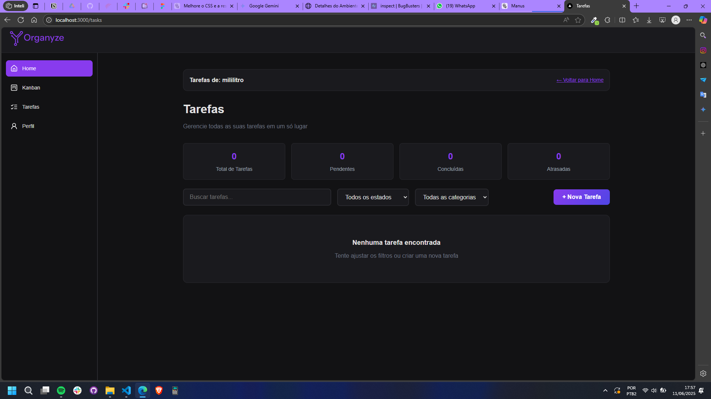
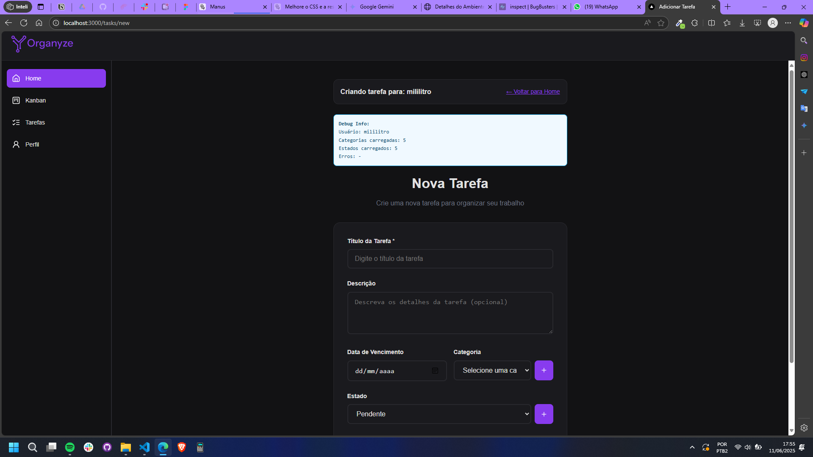
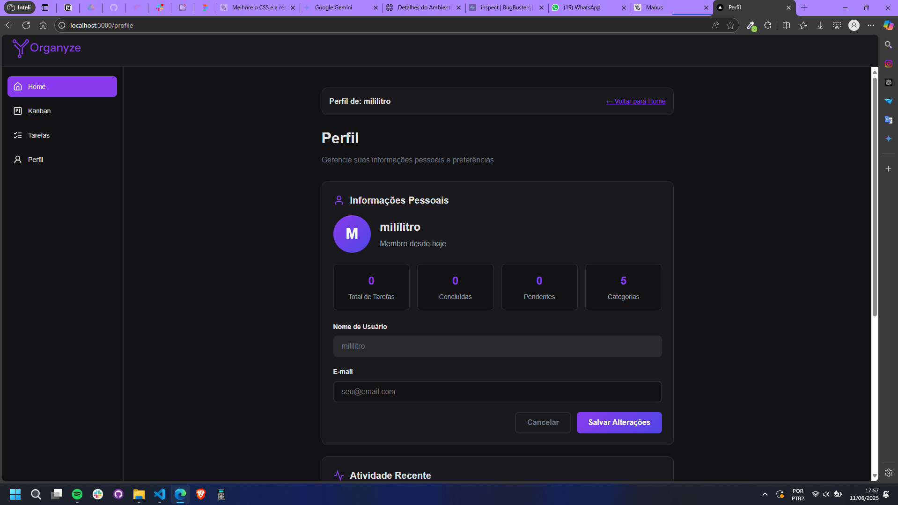

# Web Application Document - Projeto Individual - Módulo 2 - Inteli

---

#### Autor: Marcus Felipe dos Santos Valente

## Sumário

1. [Introdução](#c1)  
2. [Visão Geral da Aplicação Web](#c2)  
3. [Projeto Técnico da Aplicação Web](#c3)  
4. [Desenvolvimento da Aplicação Web](#c4)  
5. [Referências](#c5)  

## 1. Introdução

Na era digital atual, onde a gestão eficiente do tempo se tornou um desafio crucial, surge a necessidade de ferramentas que auxiliem na organização pessoal e profissional. Este projeto visa desenvolver um **gerenciador de tarefas para organização e produtividade** que atenda às demandas contemporâneas de produtividade e organização.

O sistema proposto busca simplificar a rotina dos usuários através de uma plataforma web intuitiva e acessível, permitindo um melhor controle sobre suas atividades diárias. Utilizando tecnologias modernas e práticas de desenvolvimento ágil, a aplicação foi concebida para se adaptar às diferentes necessidades de organização pessoal.

Com foco na experiência do usuário, o projeto incorpora elementos de design responsivo e interface amigável, garantindo que a ferramenta seja não apenas funcional, mas também agradável de usar. A solução proposta representa uma resposta às crescentes demandas por ferramentas digitais que promovam maior eficiência e bem-estar no gerenciamento do tempo.

---

## 2. Visão Geral da Aplicação Web

### 2.1. Personas

  

### 2.2. User Stories

### User Stories

1. **US01**: Como usuário, quero visualizar um dashboard com resumo das minhas principais tarefas, para que eu possa ter uma visão geral rápida das minhas atividades pendentes.

2. **US02**: Como usuário, quero adicionar novas tarefas com detalhes como título, descrição, prazo e categoria, para que eu possa registrar e gerenciar minhas atividades adequadamente.

3. **US03**: Como usuário, quero visualizar minhas tarefas em um quadro Kanban, para que eu possa acompanhar o progresso das atividades por estado (pendente, em andamento, concluído).

4. **US04**: Como usuário, quero acessar estatísticas e métricas sobre minha produtividade, para que eu possa analisar meu desempenho e identificar pontos de melhoria.

#### Análise INVEST da US01:

- **Independent**: A visualização do dashboard não depende de outras funcionalidades
- **Negotiable**: Os elementos e métricas exibidos podem ser ajustados
- **Valuable**: Oferece visão consolidada das atividades, agregando valor direto
- **Estimable**: Desenvolvimento possui complexidade técnica definida
- **Small**: Escopo específico para exibição de informações
- **Testable**: Pode ser validada através de testes de interface e integração

---

## 3. Projeto da Aplicação Web

### 3.1. Modelagem do banco de dados  (Semana 3)

### Modelo lógico

O modelo relacional representa a estrutura lógica do banco de dados, ilustrando as entidades principais do sistema e seus relacionamentos. No diagrama abaixo, são apresentadas as tabelas essenciais para o gerenciador de tarefas bem como seus atributos e as relações entre elas. O modelo abaixo foi projetado para um sistema de gerenciamento de tarefas colaborativas. Ele contempla usuários, tarefas, categorias, estados e o relacionamento entre esses elementos.

  

#### Tabela `Users`
Armazena informações dos usuários da plataforma.

- `id` (PK): Identificador único do usuário (chave primária).
- `name`: Nome do usuário (até 100 caracteres).
- `photo`: URL da foto de perfil do usuário (até 255 caracteres).

#### Tabela `Tasks`
Registra as tarefas criadas no sistema.

- `id` (PK): Identificador único da tarefa (chave primária).
- `title`: Título da tarefa (até 100 caracteres).
- `description`: Descrição detalhada da tarefa (até 255 caracteres).
- `created_at`: Data e hora de criação da tarefa.
- `due_date`: Prazo de entrega da tarefa.
- `category_id` (FK): Referência à categoria da tarefa.
- `state_id` (FK): Referência ao estado atual da tarefa (ex: pendente, concluída).
- `supertask_id` (FK): Referência à tarefa pai, caso essa tarefa seja uma subtarefa.

#### Tabela `Categories`
Define categorias que podem ser atribuídas às tarefas.

- `id` (PK): Identificador único da categoria.
- `name`: Nome da categoria (até 50 caracteres).

#### Tabela `States`
Define os estados possíveis para uma tarefa.

- `id` (PK): Identificador único do estado.
- `name`: Nome do estado (ex: "Pendente", "Em Progresso", "Concluído").

#### Tabela `UserTask`
Responsável por mapear a relação N:N entre usuários e tarefas.

- `id` (PK): Identificador único do vínculo.
- `task_id` (FK): Referência à tarefa atribuída.
- `user_id` (FK): Referência ao usuário responsável.

### Relacionamentos e Cardinalidade

O modelo de dados possui os seguintes relacionamentos entre as tabelas, com suas respectivas cardinalidades e funções no sistema:

#### 1. `Users` ↔ `Tasks` (N:N)
- **Descrição:** Um usuário pode estar associado a várias tarefas (por exemplo, tarefas que ele criou ou das quais participa), e uma tarefa pode estar associada a vários usuários (em casos de colaboração).
- **Implementação:** Essa relação é resolvida através da tabela intermediária `UserTask`, que contém as chaves estrangeiras `user_id` e `task_id`.
- **Cardinalidade:**
  - Um `User` pode estar vinculado a **nenhuma ou várias** `Tasks`.
  - Uma `Task` pode estar vinculada a **nenhum ou vários** `Users`.

#### 2. `Tasks` → `Categories` (N:1)
- **Descrição:** Cada tarefa pertence a uma única categoria, mas uma categoria pode agrupar várias tarefas.
- **Cardinalidade:**
  - Uma `Task` pertence a **exatamente uma** `Category`.
  - Uma `Category` pode conter **zero ou mais** `Tasks`.

#### 3. `Tasks` → `States` (N:1)
- **Descrição:** Cada tarefa tem um único estado atual (ex: "Pendente", "Concluído"). Um mesmo estado pode ser compartilhado por várias tarefas.
- **Cardinalidade:**
  - Uma `Task` pertence a **exatamente um** `State`.
  - Um `State` pode estar associado a **várias** `Tasks`.

#### 4. `Tasks` → `Tasks` (auto-relacionamento 1:N)
- **Descrição:** Uma tarefa pode ser uma subtarefa de outra. Esse relacionamento permite criar estruturas hierárquicas de tarefas.
- **Implementação:** Realizado através do campo `supertask_id`, que referencia a própria tabela `Tasks`.
- **Cardinalidade:**
  - Uma `Task` pode ser a subtarefa de **uma única** `Task` (ou de nenhuma, se for uma tarefa principal).
  - Uma `Task` pode ter **zero ou várias** subtarefas.

### Resumo visual das cardinalidades:

| Tabela A   | Relação | Tabela B   | Tipo de Relacionamento |
|------------|---------|------------|-------------------------|
| Users      | N:N     | Tasks      | Via `UserTask`          |
| Tasks      | N:1     | Categories | Muitas tarefas por categoria |
| Tasks      | N:1     | States     | Muitas tarefas por estado     |
| Tasks      | 1:N     | Tasks      | Uma tarefa com várias subtarefas |

### Modelo físico

O modelo físico do banco de dados foi implementado utilizando PostgreSQL, definindo as estruturas das tabelas, relacionamentos e constraints necessárias para suportar o gerenciador de tarefas. O schema inclui tabelas para usuários, listas de tarefas e as próprias tarefas, com seus respectivos atributos e chaves.

O arquivo SQL completo com o schema pode ser encontrado em: [others/modelo-fisico.sql](./others/modelo-fisico.sql)

### 3.1.1 BD e Models (Semana 5)

O sistema web Organyze implementa um conjunto de Models para interagir com o banco de dados PostgreSQL, encapsulando a lógica de acesso e manipulação dos dados das entidades principais da aplicação. Estes Models seguem o padrão de design de acesso a dados, oferecendo métodos estáticos para realizar operações CRUD (Create, Read, Update, Delete) de forma organizada e reutilizável. A seguir, descrevemos os Models implementados:

*   **UserModel (`models/userModel.js`):** Representa a entidade `Users` no banco de dados. Este Model é responsável por gerenciar os dados dos usuários da plataforma, como nome e foto de perfil. Ele fornece métodos para buscar todos os usuários (`getAll`), buscar um usuário específico por ID (`getById`), criar um novo usuário (`create`), atualizar os dados de um usuário existente (`update`) e remover um usuário (`delete`). A interação com a tabela `users` é feita através de consultas SQL parametrizadas para garantir a segurança contra injeção de SQL.

*   **TaskModel (`models/taskModel.js`):** Representa a entidade `Tasks`, que armazena as informações sobre as tarefas gerenciadas pelo sistema. Este Model lida com atributos como título, descrição, data de criação, prazo, categoria, estado e a possibilidade de subtarefas (através de `supertask_id`). Assim como o UserModel, oferece métodos CRUD (`getAll`, `getById`, `create`, `update`, `delete`) para interagir com a tabela `tasks`, facilitando a gestão das tarefas pelos controllers da aplicação.

*   **CategoryModel (`models/categoryModel.js`):** Modela a entidade `Categories`, utilizada para classificar as tarefas. Este Model permite gerenciar as categorias disponíveis no sistema, possuindo métodos para listar todas as categorias (`getAll`), obter uma categoria por ID (`getById`), criar uma nova categoria (`create`), atualizar o nome de uma categoria (`update`) e excluir uma categoria (`delete`). Ele interage com a tabela `categories`.

*   **StateModel (`models/stateModel.js`):** Representa a entidade `States`, que define os possíveis estados de uma tarefa (ex: Pendente, Em Progresso, Concluído). Similar aos outros Models, fornece funcionalidades CRUD (`getAll`, `getById`, `create`, `update`, `delete`) para gerenciar os estados disponíveis na aplicação, interagindo com a tabela `states`.

Todos os Models utilizam o módulo `config/db.js` para estabelecer a conexão com o banco de dados PostgreSQL, garantindo uma camada de abstração e centralização da configuração do banco.

### 3.2. Arquitetura (Semana 5)

A aplicação web Organyze adota o padrão arquitetural Model-View-Controller (MVC) para organizar sua estrutura e separar as responsabilidades. Essa abordagem promove um desenvolvimento mais modular, facilitando a manutenção e a escalabilidade do sistema. O diagrama abaixo ilustra a arquitetura MVC implementada:

  

**Componentes da Arquitetura:**

*   **Model:** A camada Model é responsável pela lógica de negócios e pela interação direta com o banco de dados PostgreSQL. Ela encapsula os dados da aplicação e as regras para manipulá-los. No projeto Organyze, os Models (`userModel.js`, `taskModel.js`, `categoryModel.js`, `stateModel.js`) contêm métodos estáticos para realizar operações CRUD (Create, Read, Update, Delete) nas tabelas correspondentes. Eles recebem solicitações dos Controllers, interagem com o banco de dados através do módulo `config/db.js` e retornam os dados processados.

*   **View:** A camada View é responsável pela apresentação dos dados ao usuário e pela interface com a qual ele interage. No Organyze, as Views são implementadas utilizando EJS (Embedded JavaScript templates) e estão localizadas na pasta `views`. Elas recebem os dados processados pelos Controllers e os renderizam em formato HTML para serem exibidos no navegador do usuário. As Views também capturam as interações do usuário (como cliques em botões e preenchimento de formulários) e as enviam para os Controllers.

*   **Controller:** A camada Controller atua como intermediária entre o Model e a View. Ela recebe as requisições HTTP do cliente (navegador), interpreta as ações solicitadas (como buscar dados, criar uma nova tarefa, etc.), interage com os Models apropriados para processar a lógica de negócios e manipular os dados, e, por fim, seleciona a View adequada para apresentar a resposta ao usuário, enviando os dados necessários para a renderização. Os Controllers (`userController.js`, `taskController.js`, etc.) orquestram o fluxo da aplicação, garantindo a separação entre a lógica de apresentação e a lógica de negócios.

**Fluxo de Dados:**

1.  O usuário interage com a **View** (ex: clica em um botão para listar tarefas).
2.  A **View** envia uma requisição HTTP para o servidor, que é direcionada para uma rota específica definida no `server.js` e nos arquivos de rotas (`routes`).
3.  A rota aciona a função correspondente no **Controller**.
4.  O **Controller** processa a requisição, chama os métodos necessários no **Model** para buscar ou manipular os dados no banco de dados.
5.  O **Model** executa as operações no banco de dados e retorna os resultados para o **Controller**.
6.  O **Controller** recebe os dados do **Model**, realiza qualquer processamento adicional necessário e seleciona a **View** apropriada.
7.  O **Controller** passa os dados para a **View**.
8.  A **View** utiliza os dados recebidos para renderizar a página HTML final, que é enviada de volta ao navegador do usuário.

### 3.3. Wireframes (Semana 03)

O wireframe apresentado ilustra quatro telas principais do sistema, demonstrando o fluxo básico da aplicação:

  

As telas apresentadas são as seguintes:

- Tela inicial com um grande resumo das principais tarefas a serem concluídas pelo usuário
- Tela de adicionar tarefa
- Tela de vizualização em kamban
- Tela de estatísticas para vizualização do progresso na produtividade do usuário

Para mais detalhes, [clique aqui](https://www.figma.com/design/8lns9JLHhsVktHfxq3R76G/Organyze?node-id=48-2&t=gAN8nGISCVM2iUKM-1) para acessar o figma com a prototipação completa.

### 3.4. Guia de estilos (Semana 05)

O sistema Organyze adota um guia de estilos coeso para garantir uma experiência de usuário consistente e visualmente agradável. A paleta de cores principal é composta por tons escuros para o fundo, com elementos de destaque em roxo vibrante, conferindo um visual moderno e focado. A tipografia utilizada é limpa e legível, priorizando a clareza das informações. Os componentes de interface, como botões, campos de entrada e cards, seguem um design minimalista com bordas arredondadas e sombras sutis, proporcionando uma sensação de profundidade e interatividade. A responsividade é um pilar fundamental do design, garantindo que a aplicação se adapte perfeitamente a diferentes tamanhos de tela, desde desktops até dispositivos móveis, sem comprometer a usabilidade ou a estética. Elementos como a barra lateral de navegação e os layouts de conteúdo são projetados para se ajustarem dinamicamente, otimizando o espaço e a legibilidade em qualquer dispositivo. O objetivo é oferecer uma interface intuitiva e eficiente, onde o usuário possa focar em suas tarefas sem distrações visuais.

O guia de estilos encontra-se disponível no [figma](https://www.figma.com/design/8lns9JLHhsVktHfxq3R76G/Organyze?node-id=0-1&t=gwQ4VpC4w6TXANxS-1)

### 3.5. Protótipo de alta fidelidade (Semana 05)

O protótipo de alta fidelidade do sistema Organyze, desenvolvido no Figma, apresenta a interface do usuário com detalhes visuais e interativos que simulam a experiência final do produto. As imagens a seguir demonstram as telas principais do protótipo, que serviram como base para o desenvolvimento do web app. É importante notar que, durante o processo de desenvolvimento, algumas telas foram modificadas ou adicionadas, resultando em diferenças entre o protótipo e a aplicação final.

Protótipos de Alta Fidelidade:

  
  
Tela Inicial (Protótipo)

  
  
Tela Kanban (Protótipo)

  
  
Tela Criar Tarefa (Protótipo)

  
  
Tela Métricas (Protótipo)

Telas Desenvolvidas (Web App):

  
  
Tela Inicial (Desenvolvida)

  
  
Tela Kanban (Desenvolvida)

  
  
Tela Todas as Tarefas (Desenvolvida)

  
  
Tela Criar Tarefa (Desenvolvida)

  
  
Tela Perfil (Desenvolvida)

Observações sobre as diferenças entre protótipo e web app:

Durante o desenvolvimento, foram observadas algumas diferenças entre as telas prototipadas e as telas implementadas no web app. Por exemplo, a tela de 'Métricas' presente no protótipo não foi implementada no web app. Por outro lado, telas como 'Todas as Tarefas' e 'Perfil' foram desenvolvidas no web app, mas não estavam presentes no protótipo de alta fidelidade. Essas variações refletem o processo iterativo de desenvolvimento, onde as necessidades e prioridades podem evoluir ao longo do tempo.

### 3.6. WebAPI e endpoints (Semana 05)

A aplicação Organyze expõe uma Web API RESTful para permitir a interação programática com os recursos do sistema, como usuários, tarefas, categorias e estados. Os endpoints seguem as convenções REST e utilizam JSON como formato de dados para requisições e respostas. A seguir, detalhamos os endpoints disponíveis, agrupados por recurso:

**Recurso: Usuários (`/api/users`)**

Gerencia os dados dos usuários da plataforma.

*   **`GET /api/users/all`**: Retorna uma lista de todos os usuários cadastrados no sistema.
*   **`GET /api/users/:id`**: Busca e retorna os dados de um usuário específico, identificado pelo seu `id`.
*   **`POST /api/users/create`**: Cria um novo usuário. Espera receber no corpo da requisição (body) um objeto JSON contendo o `name` do usuário. Retorna os dados do usuário criado.
*   **`PUT /api/users/:id`**: Atualiza os dados de um usuário existente, identificado pelo `id`. Espera receber no corpo da requisição um objeto JSON com os campos a serem atualizados (`name`, `photo`). Retorna os dados do usuário atualizado.
*   **`DELETE /api/users/:id`**: Remove um usuário do sistema, identificado pelo `id`. Retorna uma confirmação da exclusão.

**Recurso: Tarefas (`/api/tasks`)**

Gerencia as tarefas do sistema.

*   **`GET /api/tasks/all`**: Retorna uma lista de todas as tarefas cadastradas.
*   **`GET /api/tasks/:id`**: Busca e retorna os detalhes de uma tarefa específica, identificada pelo seu `id`.
*   **`POST /api/tasks/create`**: Cria uma nova tarefa. Espera receber no corpo da requisição um objeto JSON com os detalhes da tarefa (`title`, `description`, `due_date`, `category_id`, `state_id`, `supertask_id`, `user_id`). Retorna os dados da tarefa criada.
*   **`PUT /api/tasks/:id`**: Atualiza os dados de uma tarefa existente, identificada pelo `id`. Espera receber no corpo da requisição um objeto JSON com os campos a serem atualizados. Retorna os dados da tarefa atualizada.
*   **`DELETE /api/tasks/:id`**: Remove uma tarefa do sistema, identificada pelo `id`. Retorna os dados da tarefa removida.

**Recurso: Categorias (`/api/categories`)**

Gerencia as categorias utilizadas para classificar as tarefas.

*   **`GET /api/categories/all`**: Retorna uma lista de todas as categorias disponíveis.
*   **`GET /api/categories/:id`**: Busca e retorna os dados de uma categoria específica, identificada pelo seu `id`.
*   **`POST /api/categories/create`**: Cria uma nova categoria. Espera receber no corpo da requisição um objeto JSON com o `name` da categoria. Retorna os dados da categoria criada.
*   **`PUT /api/categories/:id`**: Atualiza o nome de uma categoria existente, identificada pelo `id`. Espera receber no corpo da requisição um objeto JSON com o novo `name`. Retorna os dados da categoria atualizada.
*   **`DELETE /api/categories/:id`**: Remove uma categoria do sistema, identificada pelo `id`. Retorna os dados da categoria removida.

**Recurso: Estados (`/api/states`)**

Gerencia os estados possíveis para as tarefas.

*   **`GET /api/states/all`**: Retorna uma lista de todos os estados disponíveis (ex: Pendente, Em Progresso, Concluído).
*   **`GET /api/states/:id`**: Busca e retorna os dados de um estado específico, identificado pelo seu `id`.
*   **`POST /api/states/create`**: Cria um novo estado. Espera receber no corpo da requisição um objeto JSON com o `name` do estado. Retorna os dados do estado criado.
*   **`PUT /api/states/:id`**: Atualiza o nome de um estado existente, identificado pelo `id`. Espera receber no corpo da requisição um objeto JSON com o novo `name`. Retorna os dados do estado atualizado.
*   **`DELETE /api/states/:id`**: Remove um estado do sistema, identificado pelo `id`. Retorna os dados do estado removido.

Além dos endpoints da API, a aplicação também possui rotas para renderização das páginas HTML utilizando EJS, definidas em `routes/index.js`:

*   **`GET /`**: Renderiza a página inicial de criação/login de usuário (`views/pages/create-user.ejs`).
*   **`GET /home`**: Renderiza a página principal da aplicação (`views/pages/home.ejs`).
*   **`GET /tasks/new`**: Renderiza a página para adicionar uma nova tarefa (`views/pages/new-task.ejs`).
*   **`GET /tasks/:id/edit`**: Renderiza a página para editar uma tarefa existente (`views/pages/edit-task.ejs`).  

### 3.7 Interface e Navegação (Semana 07)

O desenvolvimento do frontend do sistema web Organyze foi focado em proporcionar uma interface intuitiva e responsiva, garantindo uma experiência de usuário consistente em diferentes dispositivos. A arquitetura Model-View-Controller (MVC) foi adotada, onde a camada View é responsável pela apresentação dos dados e pela interação com o usuário. As Views foram implementadas utilizando EJS (Embedded JavaScript templates) e estão localizadas na pasta `views` do projeto.

O guia de estilos, detalhado na seção 3.4, foi fundamental para a construção visual do frontend, definindo a paleta de cores (tons escuros com destaque em roxo vibrante), tipografia limpa e legível, e componentes de interface minimalistas com bordas arredondadas e sombras sutis. A responsividade foi um pilar do design, com elementos como a barra lateral de navegação e layouts de conteúdo ajustando-se dinamicamente para otimizar o espaço e a legibilidade em desktops e dispositivos móveis.

Os wireframes (seção 3.3) e os protótipos de alta fidelidade (seção 3.5) serviram como base para o desenvolvimento das telas principais, incluindo a tela inicial com resumo de tarefas, tela de adicionar tarefa, visualização em Kanban e tela de estatísticas. Embora algumas telas prototipadas não tenham sido implementadas (como a de Métricas), outras foram adicionadas durante o desenvolvimento (como 'Todas as Tarefas' e 'Perfil'), refletindo a natureza iterativa do processo.

Em termos de código e sistema, o frontend é o resultado da renderização das Views pelo Controller, que recebe os dados processados do Model e os exibe ao usuário. As interações do usuário na interface são capturadas pelas Views e enviadas aos Controllers via requisições HTTP, completando o fluxo de dados na arquitetura MVC.

### Ilustrações das Telas Desenvolvidas (Web App):

  
  
Tela Inicial (Desenvolvida)

  
  
Tela Kanban (Desenvolvida)

  
  
Tela Todas as Tarefas (Desenvolvida)

  
  
Tela Criar Tarefa (Desenvolvida)

  
  
Tela Perfil (Desenvolvida)

---

## 4. Desenvolvimento da Aplicação Web (Semana 8)

### 4.1 Demonstração do Sistema Web (Semana 8)

*VIDEO: Insira o link do vídeo demonstrativo nesta seção*
*Descreva e ilustre aqui o desenvolvimento do sistema web completo, explicando brevemente o que foi entregue em termos de código e sistema. Utilize prints de tela para ilustrar.*

### 4.2 Conclusões e Trabalhos Futuros (Semana 8)

*Indique pontos fortes e pontos a melhorar de maneira geral.*
*Relacione também quaisquer outras ideias que você tenha para melhorias futuras.*

## 5. Referências

_Incluir as principais referências de seu projeto, para que seu parceiro possa consultar caso ele se interessar em aprofundar. Um exemplo de referência de livro e de site:_ 

---
---
