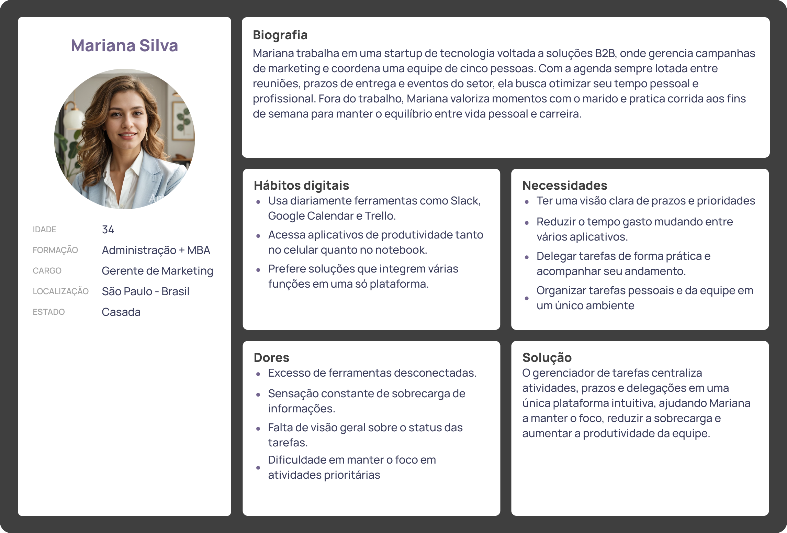

# Web Application Document - Projeto Individual - Módulo 2 - Inteli

## Nome do Projeto

#### Marcus Felipe dos Santos Valente

## Sumário

1. [Introdução](#c1)  
2. [Visão Geral da Aplicação Web](#c2)  
3. [Projeto Técnico da Aplicação Web](#c3)  
4. [Desenvolvimento da Aplicação Web](#c4)  
5. [Referências](#c5)  

## 1. Introdução

Na era digital atual, onde a gestão eficiente do tempo se tornou um desafio crucial, surge a necessidade de ferramentas que auxiliem na organização pessoal e profissional. Este projeto visa desenvolver um **gerenciador de tarefas para organização e produtividade** que atenda às demandas contemporâneas de produtividade e organização.

O sistema proposto busca simplificar a rotina dos usuários através de uma plataforma web intuitiva e acessível, permitindo um melhor controle sobre suas atividades diárias. Utilizando tecnologias modernas e práticas de desenvolvimento ágil, a aplicação foi concebida para se adaptar às diferentes necessidades de organização pessoal.

Com foco na experiência do usuário, o projeto incorpora elementos de design responsivo e interface amigável, garantindo que a ferramenta seja não apenas funcional, mas também agradável de usar. A solução proposta representa uma resposta às crescentes demandas por ferramentas digitais que promovam maior eficiência e bem-estar no gerenciamento do tempo.

---

## 2. Visão Geral da Aplicação Web

### 2.1. Personas

  

### 2.2. User Stories

### User Stories

1. **US01**: Como usuário, quero criar listas de tarefas personalizadas, para que eu possa organizar melhor minhas atividades por contexto ou projeto.

2. **US02**: Como usuário, quero definir prioridades para minhas tarefas, para que eu possa focar nas atividades mais importantes primeiro.

3. **US03**: Como usuário, quero receber notificações de tarefas próximas ao prazo, para que eu não perca deadlines importantes.

#### Análise INVEST da US01:

- **Independent**: A criação de listas personalizadas não depende de outras funcionalidades do sistema
- **Negotiable**: O formato e atributos das listas podem ser ajustados conforme necessidade
- **Valuable**: Permite melhor organização e segmentação das tarefas, agregando valor direto
- **Estimable**: Implementação possui complexidade técnica clara e mensurável
- **Small**: Escopo específico e bem delimitado
- **Testable**: Pode ser validada através de testes funcionais e de interface

---

## 3. Projeto da Aplicação Web

### 3.1. Modelagem do banco de dados  (Semana 3)

*Posicione aqui os diagramas de modelos relacionais do seu banco de dados, apresentando todos os esquemas de tabelas e suas relações. Utilize texto para complementar suas explicações, se necessário.*

*Posicione também o modelo físico com o Schema do BD (arquivo .sql)*

### 3.1.1 BD e Models (Semana 5)
*Descreva aqui os Models implementados no sistema web*

### 3.2. Arquitetura (Semana 5)

*Posicione aqui o diagrama de arquitetura da sua solução de aplicação web. Atualize sempre que necessário.*

**Instruções para criação do diagrama de arquitetura**  
- **Model**: A camada que lida com a lógica de negócios e interage com o banco de dados.
- **View**: A camada responsável pela interface de usuário.
- **Controller**: A camada que recebe as requisições, processa as ações e atualiza o modelo e a visualização.
  
*Adicione as setas e explicações sobre como os dados fluem entre o Model, Controller e View.*

### 3.3. Wireframes (Semana 03)

*Posicione aqui as imagens do wireframe construído para sua solução e, opcionalmente, o link para acesso (mantenha o link sempre público para visualização).*

### 3.4. Guia de estilos (Semana 05)

*Descreva aqui orientações gerais para o leitor sobre como utilizar os componentes do guia de estilos de sua solução.*

### 3.5. Protótipo de alta fidelidade (Semana 05)

*Posicione aqui algumas imagens demonstrativas de seu protótipo de alta fidelidade e o link para acesso ao protótipo completo (mantenha o link sempre público para visualização).*

### 3.6. WebAPI e endpoints (Semana 05)

*Utilize um link para outra página de documentação contendo a descrição completa de cada endpoint. Ou descreva aqui cada endpoint criado para seu sistema.*  

### 3.7 Interface e Navegação (Semana 07)

*Descreva e ilustre aqui o desenvolvimento do frontend do sistema web, explicando brevemente o que foi entregue em termos de código e sistema. Utilize prints de tela para ilustrar.*

---

## 4. Desenvolvimento da Aplicação Web (Semana 8)

### 4.1 Demonstração do Sistema Web (Semana 8)

*VIDEO: Insira o link do vídeo demonstrativo nesta seção*
*Descreva e ilustre aqui o desenvolvimento do sistema web completo, explicando brevemente o que foi entregue em termos de código e sistema. Utilize prints de tela para ilustrar.*

### 4.2 Conclusões e Trabalhos Futuros (Semana 8)

*Indique pontos fortes e pontos a melhorar de maneira geral.*
*Relacione também quaisquer outras ideias que você tenha para melhorias futuras.*

## 5. Referências

_Incluir as principais referências de seu projeto, para que seu parceiro possa consultar caso ele se interessar em aprofundar. Um exemplo de referência de livro e de site:_ 

---
---